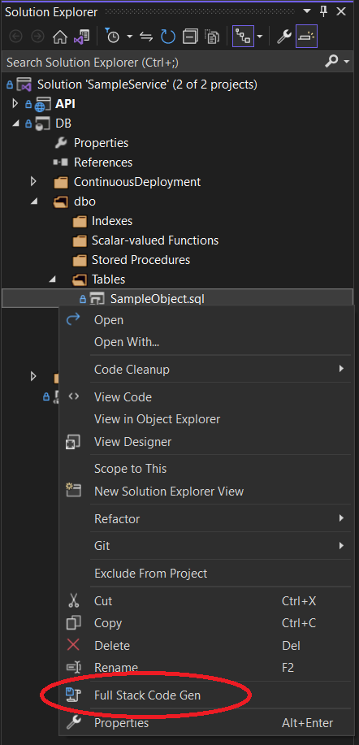
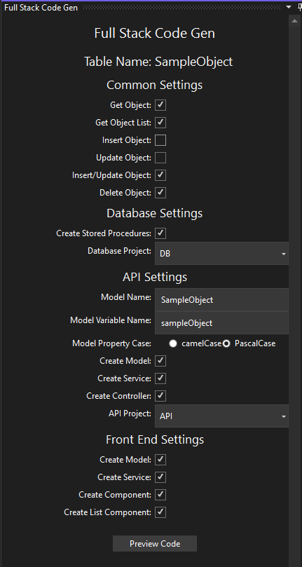

## Description
A Visual Studio extension that parses a SQL Server CREATE TABLE definition file and generates SQL Server Stored Procedures, ASP .Net Model, Service, and Controller code, and Angular Model, Service, and Components code... all with one, simple click.

## Operation
* Right-click on a *.sql file that contains a CREATE TABLE statement, similar to the following:

```
CREATE TABLE [dbo].[SampleObject]
(
    [Id] INT NOT NULL PRIMARY KEY,
    [Name] VARCHAR(50) NOT NULL,
    [Comments] VARCHAR(max) NULL,
    [Price] DECIMAL(20,2),
    [IsEnabled] BIT DEFAULT((1)) NOT NULL,
    [TypeId] INT NULL,
    [StartTimestamp] DATETIME NULL
)
```

* Select the "Full Stack Code Gen" command:



* Select the appropriate options on the "Full Stack Code Gen" tool window and click "Preview Code":



* Smile :)

# More Information

* For a complete walkthrough and explanation of features, please visit: [Full Stack Code Gen - Walkthrough](https://www.aucincorporated.com/projects/fullstackcodegen/walkthrough)